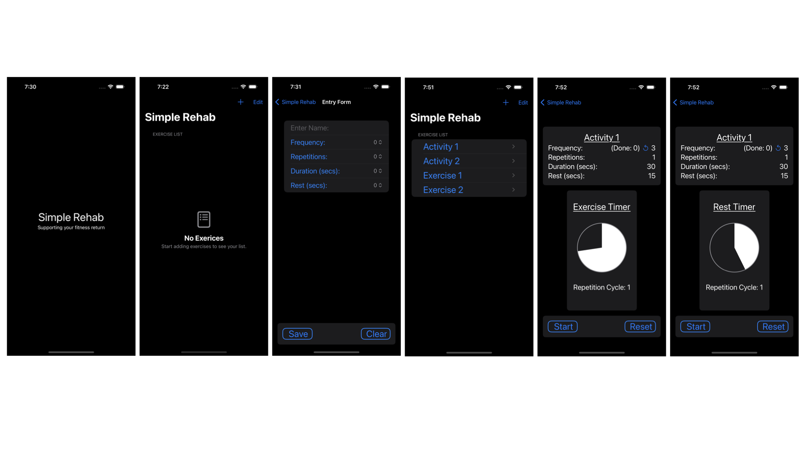

# appcoding.github.io

# My iOS App Development

## Simple Rehab

iPhone  iOS 17.0 or later

---

### App Description

Simple Rehab is more than just an app—it’s a heartfelt creation born from personal experience with prostate cancer and the subsequent journey towards recovery. Simple Rehab was written to support the creator undergoing pelvic floor rehabilitation, as well as offering a generic tool to support fitness return for others regardless of reason. 

This app was designed for simplicity and effectiveness as a straightforward tool that aids in physical recovery. It is for anyone seeking to regain physical strength requiring a tool that would aid a structured approach to rehabilitation, providing a customizable experience that adapts to a wide variety of needs.

Key Features:

•	Custom Exercise Planning: Effortlessly create an exercise list that fits into your recovery plan, with basic customizable settings that resonate with your health goals and medical guidance.

•	Goal-Oriented Scheduling: Set the frequency of your exercises that helps you maintain consistency without overwhelming your day-to-day life.

•	Tailor-Made Repetitions and Durations: Modify the number of repetitions, the duration of each exercise, and the intervals of rest to suit your evolving capabilities and comfort.

Simple Rehab was envisioned to fulfill the needs of its creator but has grown into an app that others may find useful whether recovering from surgery, managing a condition, or working towards physical betterment.

By choosing Simple Rehab, you’re not just picking an app; you’re gaining a partner in recovery. Here’s to moving forward, together, towards a stronger you.

---

### Contact Email

For any inquiries, please contact via [Email](mailto:simplerehabhelp@gmail.com.)

---

### Privacy Policy

Privacy details can be found [here](Privacy%20Policy.pdf)

---

### Copyright

© 2023 Mark Dempsey. All rights reserved.
